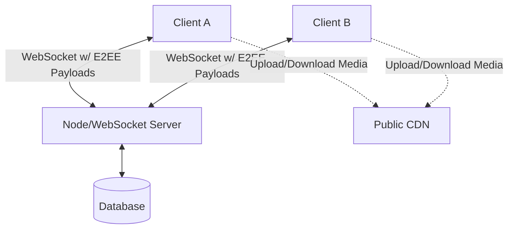

# WhisperBox

WhisperBox is an end-to-end encrypted (E2EE) messaging platform designed to prioritize user privacy and secure communication.

## Architecture Diagram

## Encryption Flow Explanation

WhisperBox employs robust end-to-end encryption to ensure that messages and metadata are never exposed in plaintext to the central server.
1. **Message Generation**: The sender creates a plaintext message in the client interface.
2. **Encryption**: The plaintext is encrypted locally on the sender's device using AES-GCM. A unique Initialization Vector (IV) is generated for each message.
3. **Transmission**: The encrypted payload (ciphertext + IV) is transmitted over a secure WebSocket connection to the server.
4. **Distribution**: The server receives the opaque payload and routes it to the intended recipient(s). The server cannot decrypt the message as it lacks the cryptographic keys.
5. **Decryption**: The recipient receives the encrypted payload and decrypts it locally using the shared session key and the provided IV to recover the plaintext message.

### Media Sharing Flow

1. **Local Encryption**: When a user selects a file, it is read into memory and encrypted locally using a newly generated 256-bit AES-GCM key and IV via the Web Crypto API.
2. **Opaque Upload**: The encrypted binary blob is uploaded to a public CDN (Cloudinary) as raw data. The CDN only hosts scrambled bytes and never sees the plaintext file.
3. **Key Transmission**: The `fileUrl`, `fileKey`, `iv`, and metadata are packaged into a JSON payload. This payload is then encrypted and sent through the standard chat session WebSocket flow.
4. **Local Decryption**: The recipient decrypts the chat message, downloads the opaque blob from the CDN URL, decrypts it using the securely transmitted key and IV, and generates a secure local Object URL for display.

## Key Management Explanation

- **Key Generation**: Cryptographic key pairs are generated securely on the client side utilizing the Web Crypto API.
- **Key Exchange**: The application utilizes a secure key exchange mechanism (such as ECDH - Elliptic Curve Diffie-Hellman) to establish shared secrets between communicating parties without transmitting the secret itself over the network.
- **Storage**: Private keys are stored locally on the user's device and never leave the client context. Public keys are distributed via the server to facilitate the initial key exchange.
- **Session Keys**: Symmetric session keys derived from the shared secret are used to encrypt and decrypt the actual messages, ensuring optimal performance and security.

## Security Trade-offs

- **Metadata Visibility**: Although the message contents are strictly encrypted, some metadata such as message timestamps, sender/recipient identities, and ciphertext sizes may still be visible to the server. While padding messages can mitigate size-based traffic analysis, it increases bandwidth consumption.
- **Key Recovery vs. Security**: Because private keys are stored entirely locally and are never escrowed on the server, a lost device or cleared browser storage results in permanent loss of access to past encrypted messages. This prioritizes absolute security over user convenience.
- **Protocol Complexity**: Implementing advanced cryptographic properties like Perfect Forward Secrecy (PFS) increases protocol complexity and state management overhead, requiring careful implementation to avoid race conditions during asynchronous message delivery.

## Known Limitations

- **Multi-Device Support**: Synchronizing E2EE keys and message history across multiple devices for a single user is currently unsupported, as it requires a complex mechanism for securely bridging trust and transferring private keys between devices.
- **Offline Messaging**: Securely queueing and delivering messages to offline users introduces challenges related to the storage of encrypted payloads on the server and ensuring forward secrecy for messages that have not yet been delivered.
